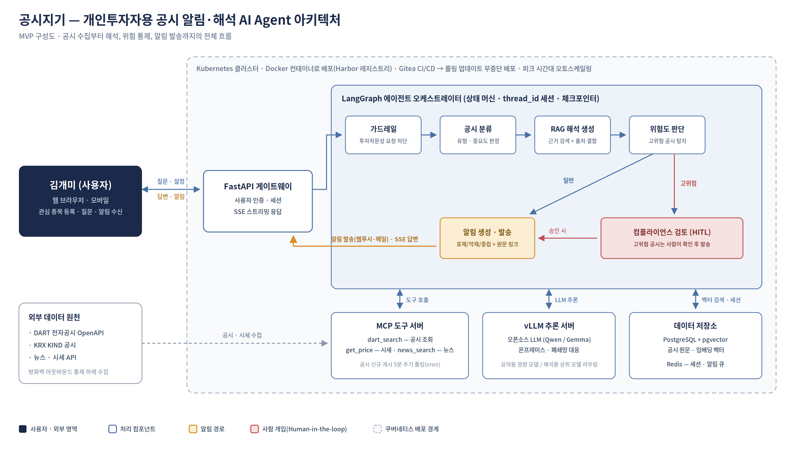

# 공시지기 (gonsijigi)

개인투자자를 위한 **공시 알림·해석 AI Agent** — 공시가 게시되고 5분 안에, 근거(원문 링크)가 붙은 해석이 도착한다. 매매 판단은 대신하지 않는다(가드레일).



## 아키텍처 ↔ 코드 매핑 (다이어그램 박스 = 폴더)

| 다이어그램 박스 | 코드 위치 | 상태 |
|---|---|---|
| FastAPI 게이트웨이 (SSE) | `app/gateway/routes.py` | 동작 |
| 컴플라이언스 검토 (HITL) 화면 | `app/gateway/admin.py` | D3 구현 지점 |
| LangGraph 오케스트레이터 | `app/agent/graph.py` — 노드는 `app/agent/nodes/` 에 파일 하나씩 (가드레일→조회→해석→위험도→알림/HITL) | 동작 |
| MCP 도구 서버 (dart_search·get_price·5분 폴링) | `app/tools/` (`poller.py` = D3) | mock → D1에 실제 DART 연동 |
| vLLM 추론 서버 클라이언트 | `app/llm/client.py` (폴백 내장) | 동작 |
| 데이터 저장소 (PostgreSQL+pgvector · Redis) | `app/rag/` (D2) + `infra/docker-compose.yml` | D2 구현 지점 |
| 출력 마스킹 (OWASP LLM02) | `app/core/redact.py` | 동작 |
| 배포 경계 (Docker → CI → K8s 선언) | `infra/` + `.github/workflows/ci.yml` | CI 동작 · K8s는 선언 |

## 실행

```bash
python -m venv .venv && source .venv/bin/activate   # Windows: .venv\Scripts\activate
pip install -r requirements.txt
cp .env.example .env    # 수업 vLLM 접속 정보 입력 (없어도 폴백 모드로 동작)
uvicorn app.main:app --reload
```

- 콘솔 데모: `python -m app.agent.graph` · 테스트: `python tests/test_smoke.py`
- 도커: `docker build -f infra/Dockerfile -t gonsijigi . && docker run -p 8000:8000 gonsijigi`

## 데모 5장면 (발표 기준)
① 실시간 알림 ② 근거 붙은 대화 답변 ③ 가드레일 거절 ④ HITL 승인 흐름 ⑤ LLM 다운 시 폴백

## 팀 규칙
`.env` 커밋 금지 · main 직접 push 금지(브랜치→PR) · 매일 16시 통합 데모 · 계획: `docs/PLAN.md`
