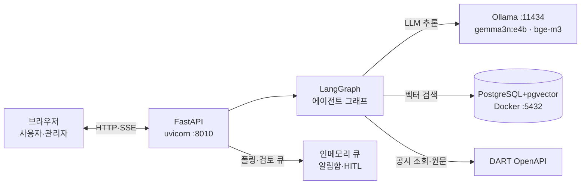
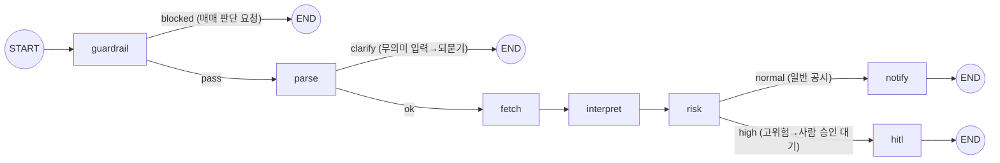

# 공시지기 (gonsijigi)

공시를 제때 확인하지 못하고, 원문을 열어도 호재인지 악재인지 해석하기 어려운
**개인투자자(페르소나 '김개미')를 위한 공시 알림·해석 AI Agent.**
공시가 게시되고 5분 안에, 근거(원문 링크)가 붙은 해석이 도착한다 — **매매 판단은 대신하지 않는다.**

▶ **실구동 데모 영상**: [풀데모 17초](docs/demo/공시지기_풀데모_1.5배속.mp4) · [라이브 해석+가드레일 30초](docs/demo/공시지기_라이브_해석과가드레일_1.5배속.mp4) — 로컬 세팅 없이 동작 확인 가능

## 1. 아키텍처

### 시스템 구성도



- **역할 분리** — 화면(FastAPI 게이트웨이), 판단(LangGraph 그래프), 지식(pgvector), 추론(Ollama), 데이터(DART 도구)가 폴더 단위로 분리되어 있다. 각 박스는 아래 폴더 구조와 1:1 대응하므로, 다이어그램의 어느 박스든 해당 폴더를 열면 그 코드가 나온다.
- **연결 관계** — 대화형 요청(/ask)은 반드시 게이트웨이→그래프를 지나며, LLM·RAG 호출은 그래프 노드에만 있다 — 화면 코드가 LLM을 직접 부르는 경로는 없다. DART 조회는 두 경로다: 그래프(fetch 노드)와 폴러(/poll — LLM 없는 결정론 선별이라 그래프를 태우지 않는다). 발송(알림함 적재)은 큐 모듈의 `deliver()` 한 곳으로 수렴하고, 그 안에서 발송 직전 마스킹이 강제된다.
- **확장·운영 고려** — LLM 호출은 `app/llm/client.py` 단일 창구(OpenAI 호환)라 상위 모델 교체가 .env 세 줄이다. 큐는 인메모리지만 인터페이스(enqueue/deliver)를 유지한 채 Redis/DB로 교체하도록 설계했다. K8s는 로드맵으로 선언만 했다(이유는 §12).

### 에이전트 그래프 (코드 `app/agent/graph.py`와 1:1)



노드 7개(guardrail·parse·fetch·interpret·risk·notify·hitl)와 조건부 엣지 3개.
`InMemorySaver` checkpointer + `thread_id` 배선은 되어 있으나, 현재 `run_agent`가
매 호출 전 필드를 초기화하므로 이전 턴 상태를 활용하지 않는다 — 멀티턴 메모리(대화
누적 활용)는 로드맵(§10)이고, 됐다고 쓰지 않는다.

## 2. ★ AI Agent 오케스트레이션 포인트

에이전트가 **스스로 판단해 흐름을 바꾸는** 지점 전부. 각 행은 코드의 `[ORCHESTRATION]` 태그와 1:1 대응한다.

| # | 결정 지점 | 위치 (파일:함수) | 판단 근거 | 분기 결과 | 설계 이유 |
|---|---|---|---|---|---|
| 1 | 가드레일 게이트 | `nodes/guardrail.py:guardrail_node` | 매매판단 키워드 + LLM 판정(이중) | 차단→즉시 END / 통과 | 안전이 기능보다 먼저 — 부적절 질문은 파이프라인 진입 전 거절 |
| 2 | 이해 게이트 | `nodes/parse.py:parse_node` | 종목·키워드·의미 낱말 유무(무LLM) | 되묻기→END / 진행 | 모르면 추측 대신 되묻는다 |
| 3 | 조회 범위 결정 | `nodes/fetch.py:fetch_node` | 질문에 명시된 종목 / '최근' 표현 | 그 종목만·7일 창 / 관심종목·당일 | 의도 존중 — 엉뚱한 종목이 답에 섞이지 않게 |
| 4 | 근거 수집 (RAG+원문 접지) | `nodes/interpret.py:interpret_node` | 현재 공시 원문 + 유사 공시 검색(k=3, 거리≤0.5) | 근거를 프롬프트에 주입 | 기억이 아니라 검색된 근거 안에서만 해석 |
| 5 | 위험도 분류 | `nodes/risk.py:risk_node` | 고위험 키워드 6종(보고서 6.6절) | high→검토 큐 / normal→알림 | 고위험 해석은 사람 승인 전 발송 금지 |
| 6 | HITL 승인 게이트 | `gateway/admin.py:approve` + `nodes/hitl.py` | 사람의 승인/반려 | 승인→알림함 발송 / 반려→폐기 | 위험한 알림은 기계에만 맡기지 않는다 |
| 7 | 5종 선별 | `tools/poller.py:poll_watchlist` | 필수 5종 카테고리 / 고위험 여부 | 알림 / 검토 큐 / 생략(skip) | 알릴 가치가 있는 것만 — 알림 피로·비용 동시 절감 |
| 8 | 데이터 소스 스위치 | `tools/dart.py:dart_search` | REPLAY_MODE / 키·매핑·호출 성공 여부 | 리플레이 / 실호출 / mock 폴백 | 어떤 외부 의존이 죽어도 데모가 죽지 않게 |

> 코드에서 `[ORCHESTRATION]`, `[SAFETY]`, `[COST]` 로 검색하면 전 지점을 추적할 수 있습니다: `grep -rn "\[ORCHESTRATION\]" app/`

## 3. 폴더 구조 — 설계 박스 ↔ 폴더 1:1

```
app/
├─ agent/            # LangGraph 오케스트레이터 (보고서 6.4절)
│  ├─ graph.py       #   그래프 조립·라우터 3개 — 오케스트레이션의 중심
│  ├─ state.py       #   공유 상태(생산자/소비자 계약 주석)
│  ├─ prompts.py     #   프롬프트 원본(스포트라이팅 경계)
│  └─ nodes/         #   노드 7개 = 파일 7개 (가드레일→파싱→조회→해석→위험도→알림|HITL)
├─ gateway/          # FastAPI 화면·API (사용자 홈/관심종목 · 관리자 검토/알림함)
├─ llm/client.py     # LLM 단일 창구 (OpenAI 호환 · 폴백 내장)
├─ rag/              # pgvector RAG (적재 ingest · 검색 retriever, 보고서 6.5절)
├─ tools/            # 도구: DART 조회·5종 분류·알림 카드·폴러 (보고서 6.3절)
└─ core/             # 설정(.env 로더) · 출력 마스킹(OWASP LLM02)
data/                # 리플레이 샘플(실제 공시) · 관심종목(gitignore) · 코드 매핑(생성물)
docs/                # 문서 전부(§14) + demo/ 실구동 영상 + 발표자료 pptx
infra/               # Dockerfile · docker-compose(pgvector) · k8s(선언만)
scripts/             # 발표 아침 점검·리플레이 재생성·치트시트
tests/               # 오프라인 스모크 12종 + 통합 검증(verify_demo/verify_rag)
```

## 4. 빠른 시작

```bash
# 0) 준비: Python 3.13 권장 · (풀스택이면) Docker + Ollama
python -m venv .venv && source .venv/bin/activate
pip install -r requirements.txt
cp .env.example .env          # 실제 값은 .env에만 — 키는 opendart.fss.or.kr에서 발급

# 1) 리플레이 모드(외부 의존 최소 — 처음엔 이걸로)
REPLAY_MODE=true uvicorn app.main:app --port 8010
# → http://127.0.0.1:8010  (관리자: /admin/)

# 2) 라이브 모드(실제 오늘 공시 — DART 키 필요)
uvicorn app.main:app --port 8010

# 3) 풀스택(RAG 근거까지 — pgvector+Ollama)
docker compose -f infra/docker-compose.yml up -d db
ollama pull bge-m3 && ollama pull gemma3n:e4b
python -m app.rag.ingest --clear      # 실제 공시 코퍼스 적재

# 발표(시연) 아침 루틴 3종
python scripts/demo_morning.py        # 인프라 점검 + 오늘 공시 스캔(코스피·고위험 표시)
python scripts/prepare_replay.py      # 리플레이 샘플을 당일 실데이터로 재생성
python scripts/replay_cheatsheet.py   # 그날 샘플 기준 '되는 질문' 목록 자동 생성
```

상세(화면 지도·데모 코스·트러블슈팅): [docs/실행가이드.md](docs/실행가이드.md)

## 5. 데모 시나리오 5장면

| 장면 | 한 줄 | 확인 |
|---|---|---|
| ① 실시간 알림 | 새 공시가 5종 뱃지·자금목적 라벨과 함께 패널에 | [풀데모 영상](docs/demo/공시지기_풀데모_1.5배속.mp4) |
| ② 근거 붙은 대화 | 원문 접지+RAG 근거로 [유형/사실/해석 참고] 구조 응답 | [라이브 영상](docs/demo/공시지기_라이브_해석과가드레일_1.5배속.mp4) |
| ③ 가드레일 | "그래서 팔까?" → 즉시 정중 거절 | 두 영상 공통 |
| ④ HITL | 유상증자가 검토 큐에 멈추고, 승인해야 발송 | 풀데모 영상 |
| ⑤ 폴백 | .env를 비워도 죽지 않는다(mock·폴백 요약) | `tests/verify_demo.py` |

시연 대본: [docs/발표_대본_v2.md](docs/발표_대본_v2.md) · [demo_scenario.md](docs/demo_scenario.md)

## 6. 안전·리스크 설계 — "프롬프트가 아니라 코드로 강제"

| 위험 | 통제 | 위치 |
|---|---|---|
| 투자 권유(규제) | 가드레일 이중 필터 + 단정 금지 표현 통제 | `nodes/guardrail.py` · `prompts.py` |
| 환각 | 원문 접지 + RAG(거리≤0.5) + [사실/해석] 구조 분리 | `nodes/interpret.py` |
| 출처 누락 | 검사하는 게 아니라 **코드가 무조건 부착** | `tools/notify_format.py` |
| 민감정보 유출(LLM02) | 발송 직전 마스킹(키·이메일·주민번호) | `core/redact.py` |
| 프롬프트 인젝션(LLM01) | 공시 원문을 스포트라이팅 경계로 격리 | `prompts.py` |
| 고위험 오발송 | HITL — 사람 승인 전 발송 금지 | `nodes/hitl.py` · `gateway/admin.py` |

코드에서 `[SAFETY]`로 검색하면 전 지점이 나온다. 이 중 거절·출처·마스킹 3불변은 CI가 매 커밋 검증한다.

## 7. 테스트·CI

- `python tests/test_smoke.py` — **오프라인 스모크 12종**(키·네트워크 불필요): 가드레일 차단 / 출처·면책 부착 / 마스킹 / 위험 공시 선별(P1 회귀 방어) / 파싱 4종 / 최근 창 / 5종 분류 / 목적 라벨
- `python tests/verify_demo.py` — 리플레이로 그래프+HITL 큐+승인+알림함 전 경로 통합 검증(샘플 독립적)
- `python tests/verify_rag.py` — pgvector 코퍼스 적재·검색 거리 실측
- CI(GitHub Actions): 매 push/PR마다 문법 검사+스모크 → Docker 빌드

## 8. 기술 스택과 역할

| 기술 | 이게 뭔가 | 우리 프로젝트에서 |
|---|---|---|
| uvicorn·FastAPI | 웹서버·프레임워크 | 화면 4종 + SSE 스트리밍 응답 |
| LangGraph | LLM 흐름을 상태 그래프로 | 조건부 분기 3개 + checkpointer 대화 맥락 |
| LangChain 부품 | 검증된 컴포넌트 | pgvector 스토어·임베딩·청킹·OutputParser만 선별 사용 |
| Ollama + gemma3n:e4b | 로컬 LLM 서버 | 해석 생성(온프레미스) |
| bge-m3 | 다국어 임베딩(1024차원) | 공시 청크·질문 벡터화 |
| PostgreSQL+pgvector | 벡터 검색 확장 | 과거 공시 159청크 · 유사 검색 |
| DART OpenAPI | 전자공시 공식 API | 목록·원문 조회(폴백 내장) |
| Docker · GitHub Actions | 재현 환경 · 자동 검증 | pgvector 1컨테이너 · 스모크+빌드 CI |

풀버전: [docs/기술_역할_한장.md](docs/기술_역할_한장.md)

## 9. ★ 모델 선택과 토큰 비용 전략

**왜 로컬 Ollama + gemma3n:e4b인가**
1. **외부 API 토큰 과금 0원** — 개발·시연 중 수백 회 호출이 전부 무료였다.
2. **프라이버시** — 관심종목·질문 등 사용자 데이터가 기기 밖으로 나가지 않는다(금융 도메인의 망분리 전통과 부합, 보고서 3장).
3. **경량 구동** — e4b는 M4 32GB에서 GPU 서버 없이 돈다.

트레이드오프(정직하게): 소형 모델이라 표 안의 숫자 추출이 가끔 불안정하다 — 그래서 원문 링크 상시 부착 + 고위험 HITL로 보완하고, `llm/client.py` 단일 창구(OpenAI 호환)라 필요 시 상위 모델로 교체·라우팅할 수 있게 했다.

**토큰·호출 절약 장치** (코드의 `[COST]` 태그와 1:1)

| 장치 | 위치 | 무엇을 아끼나 |
|---|---|---|
| 가드레일 조기 차단 | `nodes/guardrail.py` | 부적절 질문은 LLM 파이프라인 진입 전 거절 — 이후 모든 호출 생략 |
| 무LLM 파싱·분류 | `nodes/parse.py` · `tools/categories.py` | 종목/5종/목적 판별에 토큰 0 (결정론) |
| 5종 선별 | `tools/poller.py` | 해당 없는 공시는 해석 LLM 호출 자체를 생략 |
| 원문 '목적 구간' 발췌 | `nodes/interpret.py` | 전문 대신 1.5k자+목적 구간만 주입 — 입력 토큰 절약 |
| RAG k=3·거리 필터 | `rag/retriever.py` | 관련 청크만 프롬프트에 — 무관 근거로 인한 낭비·오염 차단 |
| 리플레이 모드 | `tools/dart.py` | 시연 반복 중 DART 외부 호출 0건 |

## 10. ★ AI Agent 특징 매핑 (수업 ↔ 구현)

| 수업에서 배운 특징 | 우리 구현 | 위치 |
|---|---|---|
| **추론/생각(Thought)** | 분류·해석·위험도 판단이 에이전트의 '생각'. `[ORCHESTRATION]` 주석이 생각→행동 순서로 서술(ReAct). **판단 근거(위험 키워드·해석)가 검토 큐 화면에 그대로 노출되어 사람이 에이전트의 생각을 검증** | `nodes/*` · `gateway/admin.py` |
| 도구 사용(Tool Use) | DART 목록·원문 조회, RAG 벡터 검색, 시세(mock) | `tools/dart.py` · `rag/retriever.py` |
| 에이전트 루프 | 폴링→선별→(해석)→분기→발송의 자율 흐름 | `tools/poller.py` + 그래프 |
| 가드레일 | 이중 필터 + 표현 통제 + 출력 구조 강제 | `nodes/guardrail.py` · `prompts.py` |
| Human-in-the-loop | 고위험 승인 게이트(승인해야 발송) | `nodes/hitl.py` · `gateway/admin.py` |
| 상태 관리 | LangGraph State + checkpointer(thread_id) | `agent/state.py` · `graph.py` |

**로드맵(미구현 — 됐다고 쓰지 않음)**: 멀티턴 메모리(대화 누적 활용) · Handoff/멀티에이전트 · A2A · 5분 자동 폴링 루프 · 모델 라우팅

## 11. 정직한 한계와 로드맵

전부 "모르고 빠뜨린 것"이 아니라 **알고 선을 그은 것**이다:
- 소형 LLM의 표 숫자 추출 불안정 → 원문 링크 상시 + HITL로 보완 (모델 교체 여지)
- 정정공시 최종본(`last_reprt_at=Y`) 미적용 → 정정 건별 알림이 여러 개 올 수 있음
- admin 접근제어 없음(뷰 분리만) → JWT 인증과 함께 로드맵
- 종목명 띄어쓰기 변형("블루산업 개발") 미매칭 → 별칭 사전으로 부분 보완
- 인메모리 큐(재시작=초기화, 데모 리셋으로 활용) → Redis/DB 교체 설계 완료
- 웹푸시·알림톡 / BM25 앙상블·멀티쿼리 / K8s 실배포 / MCP 서버 분리 — 스프린트 범위 밖 선언

## 12. 팀

**팀 공시지기** — 조현준 · 박조현 (2026 계절학기 AI Agent 과정)

## 13. 문서 인덱스

**개발 문서** — [실행가이드](docs/실행가이드.md)(켜는 법·화면 지도·트러블슈팅) · [기술_역할_한장](docs/기술_역할_한장.md) · [공시_도메인_한장](docs/공시_도메인_한장.md)(DART 표기·주요 공시 근거) · [HANDOFF_D2](docs/HANDOFF_D2.md)(RAG 세팅) · [PLAN](docs/PLAN.md)(일자별 계획+진행 현황)
**발표 산출물** — [발표자료 pptx](docs/발표자료_공시지기_팀.pptx) · [발표_대본_v2](docs/발표_대본_v2.md)(설계↔구현 대비) · [발표_대본](docs/발표_대본.md) · [발표_QA노트](docs/발표_QA노트.md)(사고 기록·예상 Q&A) · [demo_scenario](docs/demo_scenario.md) · [demo/ 영상 2편](docs/demo/)

## 팀 규칙

`.env` 커밋 금지 · main 직접 push 금지(브랜치→PR→CI) · PR마다 QA노트에 예상 Q&A 1건 이상 추가 · 상세: [CLAUDE.md](CLAUDE.md)
